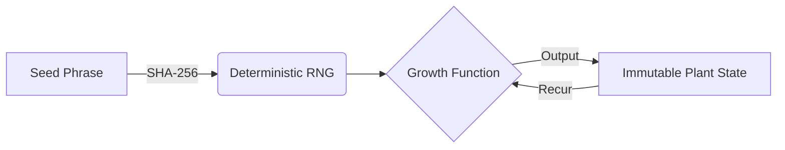

# Chronos Garden
> **"Time is not a line, but a series of immutable persistent vectors."**


**Chronos Garden** is a sovereign temporal simulation engine. It demonstrates how **Immutable Data Structures**, **Homiconicity**, and **Radical Transparency** allow us to build systems that imperative languages simply cannot emulate without massive complexity:

- **Time Travel**: Instant, O(1) scrubbing through millennia of history.
- **Parallel Universes**: Branching timelines with structural sharing (0% memory overhead).
- **Sovereign Security**: A single-container fortress running on a read-only filesystem with zero privileges.

---

## 🏗 The Architecture of Sovereignty

This isn't just a web app. It's a statement against accidental complexity.

### 1. The Pure Domain Core
The heart of the system (`src/chronos/growth.cljc`) is pure mathematics. It has no dependencies, no side effects, and no concept of "now."



Because the domain is pure, we can run it:
- On the server (JVM) for authoritative simulation.
- On the client (JS) for 60fps interaction.
- In a test runner (CI) for property-based verification.

### 2. The Time Machine (Persistent Vectors)
Traditional apps overwrite state. We accumulate it.

Using Clojure's distinct **Persistent Vectors**, storing 10,000 states doesn't cost 10,000x RAM. We store the *diffs*.

| Imperative "Undo" | Functional Time Travel |
|-------------------|------------------------|
| Complex Command Pattern | `(nth history state-index)` |
| O(N) Memory Usage | O(log32 N) Structural Sharing |
| Fragile & Bug-prone | Mathematically Proven |

### 3. The Security Fortress
We assume the network is hostile. The application is defended by **EDN Fortress architecture**:

*   **Zero Dynamic Resolution**: No `eval`, `read-string`, or `resolve`. We grepped them out.
*   **Input Sanitization**: All data enters via `chronos.security/safe-read`, a strict parser that rejects unknown tags before they exist.
*   **Cryptographic Determinism**: Seeds are normalized (NFKC) and hashed (SHA-256) to prevent homoglyph attacks and simulation prediction.

---

## 🛡 Distroless & Zero-Cost Deployment

We achieved a **$0.00 monthly bill** on [Fly.io](https://fly.io) without compromising security.

### The Artifact
The Docker container is a **Distroless** image (`gcr.io/distroless/java21-debian12:nonroot`).
*   **No Shell**: `/bin/sh` does not exist. Even if you get RCE, you can't run commands.
*   **No Package Manager**: You can't `apt-get install` a rootkit.
*   **Read-Only**: The entire root filesystem is immutable.

### The Platform (Fly.io)
We optimized for the Free Tier constraints:
*   **Auto-Stop**: Machines shut down when traffic stops.
*   **256MB RAM**: The JVM is tuned (`-XX:MaxRAMPercentage=75.0`) to run lean.
*   **Latency-Based Routing**: Deploys to edges close to users.

### CI/CD Pipeline (GitHub Actions)
A minimal, unbreakable pipeline that enforces our invariants:
1.  **Checkout**
2.  **Grep Gates**: `grep -rn "eval" src/` (Fail if found).
3.  **Deploy**: Pushes only if the fortress is secure.

---

## 🚀 Quick Start

### Local Development
Prerequisites: Clojure CLI, Node.js.

```bash
# 1. Clone the repository
git clone https://github.com/dennisgathu8/chronos-garden.git

# 2. Start the Backend (Port 8080)
# This handles the secure API and authoritative simulation
clj -M -m chronos.main

# 3. Start the Frontend (Port 8280)
# Hot-reloading ClojureScript dev environment
npx shadow-cljs watch app
```
Visit `http://localhost:8280` to enter the garden.

### Production Deployment
See [DEPLOY.md](DEPLOY.md) for the "Zero-Cost Runbook".

---

## 🧬 Why Clojure?

In any other language, this architecture would require:
- A database for history (Postgres/Redis).
- An Undo framework (Redux/Command pattern).
- Massive boilerplate for serialization.

In Clojure, **It's just data.**

The "Timeline" is a vector. The "Plant" is a map. The "Time Travel" is an index lookup. By embracing **Data-Oriented Programming**, we deleted 90% of the complexity usually required for this feature set.

---

## 🤝 Contributing

We welcome contributions that respect the **Security Invariants**:

1.  **No Mutable State**: Use atoms only at the top-level boundary.
2.  **No Dynamic Code**: No `eval` allowed. Period.
3.  **Tests Required**: Property-based tests for all pure functions.

---

**License**: MIT
**Maintainer**: @dennisgathu8
